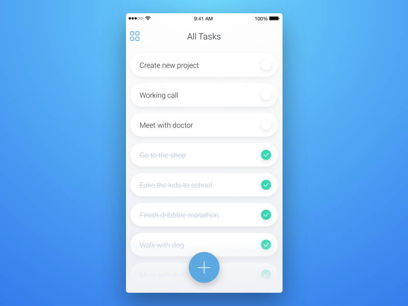

A junior colleague went on vacation and handed over a half-done application for you to finish.

He is a very keen learner and benefits a lot from good feedback. Please finish the application and <b>provide a thorough review</b>, touching on all of the issues with the code, explaining the what and the why. Feel free to refactor anything you deem appropriate.

---

This is a basic TODO list application. Requirements are as such:

- Should keep a list of tasks which can be "active" and "completed".
- New task is added as "active".
- Clicking on "active" task marks it as "completed" by crossing it out.
- Should show a total count of all tasks in the list.
- Name for a new task is specified by typing in an input field.

On top of initial requirements our analytics team has recently discovered two things:

- Some of our future users prefer dark mode.
- Some of our future users might have disabilities such as visual or mobility impairments.

Please adjust the app to accommodate their needs.

---

If there is anything unclear about the exact requirements, use your best judgement. There is no one right solution so you are welcome to add a small report with your reasoning of implementation choices.

Styling of the application is not important, the screenshot below added just for your own inspiration.

